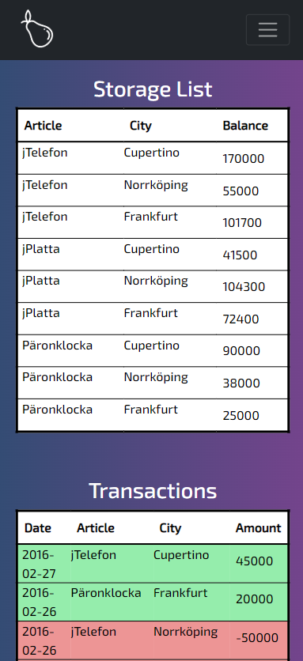

# Transaction App
## DJANGO - REACT

I created an app that would handle transactions of different products in different storages, to help keep track of the storage levels.
The main focus was on creating a backend that could handle and keep track of the different transactions, and to create a solid connection between the backend and the frontend.

This was one of my first projects that I tried to learn frontend-development using a framework like React.
The goal was to make a good looking UI without making it too complicated. I also wanted the design to be responsive.

There are certaintly a lot to be done about the code, and maybe in the future I might come back to this project!

 

